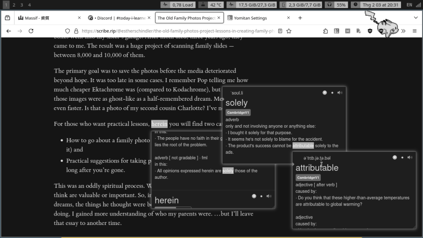

## Yomitan là gì?

Yomitan (trước đây là Yomichan) là tiện ích mở rộng trình duyệt (browser extension) giúp tra từ vựng trên trình duyệt nhanh bằng cách di chuột (hover) vào từ.

*Tra liên tiếp nghĩa của các từ Tiếng Anh trong quá trình sử dụng từ điển đơn ngữ*

Một điểm cực kì quan trọng nữa là Yomitan tích hợp với Anki, tạo thành một combo học từ vựng *thần thánh* (Không nói quá đâu nhé :)) Nó xịn quá luôn ấy).

Đọc Documentation của Yomitan: <https://yomitan.wiki/>

## Tiếng Anh

- [Dự án từ điển Tiếng Anh cho Yomitan](/tu-dien-anh-viet-yomitan/) - Hiện tại mới hỗ trợ bản từ điển của OVDP.

## Tiếng Nhật

- [Dự án từ điển Tiếng Nhật cho Yomitan](/tu-dien-nhat-viet-yomitan/) - Bao gồm từ điển JaViDic và Suge.
- [Mazii Yomitan](/mazii-yomitan/) - Từ điển Nhật - Việt Mazii cho Yomitan.

## Tiếng Trung

- [Tiếng Trung](/tu-dien-trung-viet-yomitan/) - Bao gồm từ điển Tiếng Trung mtBab và VDICT.
- [Từ điển Chữ Hán (Hanzi)](/tu-dien-hanzi-yomitan/) - Từ điển Hán Tự Tiếng Trung cho Yomitan.

## Các ngôn ngữ khác

Kho từ điển Yomitan cho các ngôn ngữ như Tiếng Đức, Tiếng Pháp, Tiếng Tây Ban Nha, Tiếng Bồ Đào Nha, Tiếng Nga, Tiếng Ý, Tiếng Thái, Tiếng Ả Rập.

- [Từ điển Tiếng Pháp](/tu-dien-phap-viet/)
- [Từ điển Tiếng Đức](/tu-dien-duc-viet/)
- [Từ điển Tiếng Tây Ban Nha - Tiếng Việt](/tu-dien-tbn-viet/)
- [Từ điển Tiếng Bồ Đào Nha - Tiếng Việt](/tu-dien-bdn-viet/)
- [Từ điển Tiếng Nga - Tiếng Việt](/tu-dien-nga-viet/)
- [Từ điển Tiếng Ý - Tiếng Việt](/tu-dien-y-viet/)
